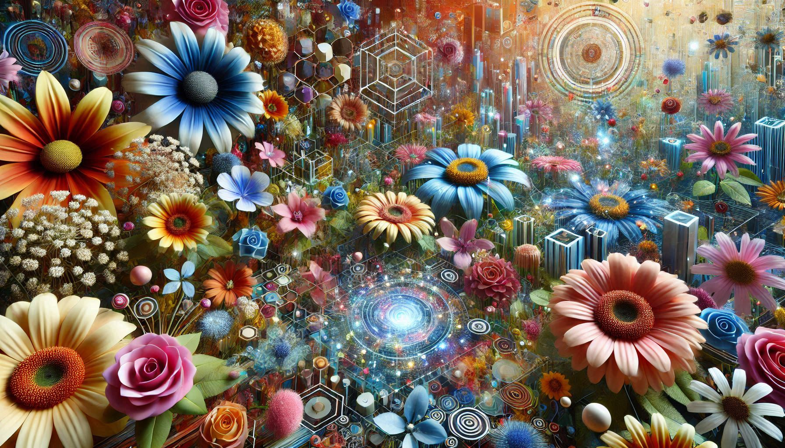

A digital garden is like a botanical garden, it is full of growing things, but instead of plants it's our thoughts.

In 1941, the Argentine writer and poet [Jorge Luis Borges](https://en.wikipedia.org/wiki/Jorge_Luis_Borges "Jorge Luis Borges") published "**The Garden of Forking Paths**" (original Spanish title: "El jardín de senderos que se bifurcan"), a short story about alternate futures or storylines that some have said to inspire the concept of the [hypertext](https://en.wikipedia.org/wiki/Hypertext), which led eventually to the creation of the World Wide Web, a "killer app" for the then emerging concept of the Internet.

A digital garden is never meant to be finished, it is ever growing and developing, reflecting the evolution and development of our thoughts and learnings. It is different from a personal blog, because the articles are not structured linearly or chronologically, and evolve over time, reflecting our personal growth, reflection, and knowledge. Digital gardens are also different from personal journals, as each entry is ever-changing and connected to other entries. Digital gardens reflect their owners' thinking styles. The end result is hopefully a sustainable, self-sufficient ecosystem, rather than a predetermined design or structure.

For more information, read [A Brief History & Ethos of the Digital Garden](https://maggieappleton.com/garden-history).