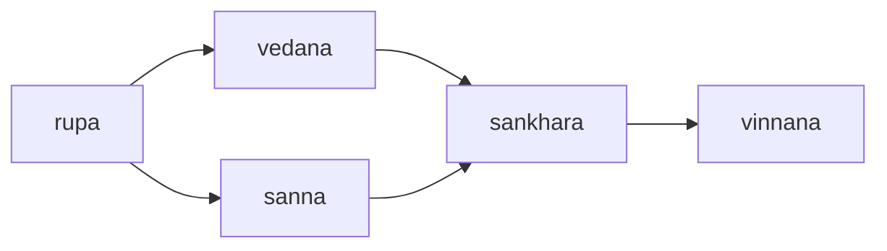

These are some thoughts on a suggested structure for a [[Second Brain|second brain]], based on ideas from:
- [Zettelkasten](https://zettelkasten.de)
- [Evergreen notes](https://notes.andymatuschak.org/Evergreen_notes)
- Molecular notes: [Principles](https://reasonabledeviations.com/2022/04/18/molecular-notes-part-1/) and [Practice](https://reasonabledeviations.com/2022/06/12/molecular-notes-part-2/)

I am calling my second brain “Khandha”, which is short for “pañcupādānakkhandhā”, the five collections that supposedly all living beings are composed of, according to the Buddha. These collections represent our physical body and everything we observe, our feelings, our perceptions and memories, our thoughts and our consciousness. pañcupādānakkhandhā can be loosely translated as “five masses of burning fuel” (to paraphrase Richard Gombrich) and seemed an appropriate phrase to use for the second brain.
## Purpose

My second brain is intended to help me learn from diverse sources (books, textbooks, articles, courses), distil insights, and synthesise new ideas. It organises all the information related to a set of topics that I wish to learn about in a structured network of documents.

## Key principles

### Use Markdown as the primary content format

Markdown is simple to learn and easy to use - it has taken the de facto crown of the "One True Universal Document Format." The content in the second brain is primarily organised as a set of markdown files stored in various folders, cross linking to each other. The folder location of the markdown document does not dictate it's hierarchy in the thinking process. The content in source files should be converted from it's native format to Markdown (plus if required images and multimedia) as much as possible.

### Use diagrams and images appropriately

Try and stick to Mermaid for diagrams and use other tools (eg. PlantUML) by exception. Images should be used where appropriate, but the second brain is not a photo gallery.
### Documents should be atomic

Each document in the second brain (with the exception of source content or summaries of them) should be about one thing, and one thing only.

### Link between documents as much as possible

Documents where possible should link to other related documents. A richly linked network of documents promote exploration and connection between concepts.

### Structure documents into hierarchies sparingly

The default location for a document should be outside a folder. Folders can be used to group related documents together in accordance to preference (some hints provided in [[#Possible folder suggestions]]) but avoid over-classifying documents into a complex multi-hierarchy based on multiple factors. Just because a document is in a folder not necessarily imply it exclusively belongs there - folder structure does not impose hierarchy.

### Write in a personal blog style

Do not write in academic tone. The second brain is meant to reflect how I think. Personal pronouns are okay. Personal opinion, unjustified, is also okay.
## Structure

The structure of my second brain is loosely based on the concept of interpreting data into information, transforming information into knowledge, and ultimately applying knowledge to gain wisdom, as described by the [Knowledge Pyramid](https://en.wikipedia.org/wiki/DIKW_pyramid)

![[DIKW.png|400]]

The second brain is divided into 5 categories, based on the level of processing of the content. The categories are inspired by "pañcupādānakkhandhā" (the Buddha's classification of the five key components of our mental process and consciousness):

1. **[[#rupa]]** (input source documents and content in their original format) - "data" in the knowledge pyramid
2. **[[#vedana]]** (evaluation or critical analysis of rupa)
3. **[[#sanna]]** (interpretation and summary of rupa) - "information" in the knowledge pyramid
4. **[[#sankhara]]** (key concepts derived from vedana and sanna) - "knowledge" in the knowledge pyramid
5. **[[#vinnana]]** (new concepts and insights based on combining and analysing sankhara) - "wisdom" in the knowledge pyramid

Note that the original Pali terms for these include diacritical marks (ie. rūpa, vedanā, sañña, saṅkhāra, viññāṇa). For the purposes of using these as categories, I have elected to remove these diacritical marks to ease reading and typing, as they simply serve as identifiers or tags for the various documents in the second brain.

### rupa

**rūpa** is a Pali word meaning physical form, matter, an object we can sense. In the context of the second brain, rupa refers to the input source files, in their original format, that forms the basis of the knowledge that we will build. rupa corresponds to "data" in the knowledge pyramid. It is important to understand rupa is not necessarily accurate or validated, it is whatever we have acquired into the second brain, and it needs to be evaluated and critically analysed.
### vedana

**vedanā** is a Pali word describing our feelings and sensations relating to rūpa that we have observed, for example the joy and delight of witnessing a beautiful scenery. In the context of the second brain, rupa refers to our evaluation and critical analysis of the input source files, for example a "review" of a novel we have read, a film that we have seen or music that we have listened to. It is our reaction to digesting the input content. It is important to note this evaluation can be either objective or subjective.

### sanna

**sañña** is a Pali word describing our perceptions, internalised symbols or representations of rūpa that we have recognised. In the context of the second brain, sanna represents summaries of the original source content, grouped into concepts where possible. sanna corresponds to "information" in the knowledge pyramid.

### sankhara

**saṅkhāra** is a Pali word describing the results of our thought processes or activities, and in particular reflecting specific perspectives or opinions that are formed based on our apperceptions (sañña). In the context of the second brain, sankhara are atomic concepts derived from our summaries and evaluations of source content, capturing discrete items of knowledge that we wish to retain, like Wikipedia entries. sankhara represents abstract and generic concepts of objects that we have categorised as "belonging to the same type", ie. when we think of a "dog" our mental representation is an idealised generic dog rather than a specific dog. If we identify the same concept described across multiple input sources, we merge and derive an abstract, idealised or blended definition of the concept so that there is no duplication. sankhara corresponds to "knowledge" in the knowledge pyramid.

### vinnana

**viññāṇa** is a Pali word describing awareness, or consciousness. In the context of the second brain, vinnana represents new ideas, insights and innovation that we have formed based on the application of concepts that we have defined in sankhara. It is important that we use our own words to describe each item of vinnana as it represents our thinking and expansion/extrapolation about what we have digested. These are the "gems" of our second brain. vinnana corresponds to "wisdom" in the knowledge pyramid.

## Role of AI

Artificial Intelligence, particularly Generative AI, can be useful as content in the second brain. AI output is treated as an input source, and usually placed in the rupa category, as "material content". Alternatively AI can also be used to summarise rupa into sanna. However, it is important to analyse and validate AI generated content like any other input source, and AI should never be used to generate sankhara or vinnana type documents which are the results of our thinking process.

## Process

Input sources are ingested into the second brain, and then can be evaluated into vedana or summarised/conceptualised into sanna. Based on this, sankhara and vinnana are eventually generated.

## Possible folder suggestions

- Have an Inbox folder for new incoming source content before they are moved to their appropriate locations.
- Consider a Work in Progress folder. Other option is to consider the entire Second Brain as a never finished work in progress, but have a Task List of documents currently being edited,
- Create folders by topics, projects, ...
- Create folders by category types (rupa, vedana, ...)

## Comparison to Bloom's Taxonomy

![[blooms_taxonomy.png.jpg]]

| Bloom's Taxonomy | Khandha                 |
| ---------------- | ----------------------- |
| create           | vinnana                 |
| evaluate         | vedana                  |
| analyse          | vedana, sanna, sankhara |
| apply            | sankhara                |
| understand       | sanna                   |
| remember         | rupa                    |

## Implementation

Khandha can be implemented on any tool that supports editing of Markdown files, which include text editors. Personally, I have chosen to use [Obsidian](https://obsidian.md) but I also use [Visual Studio Code](https://code.visualstudio.com) to make changes.

<a class="rich-link-card" href="https://obsidian.md" target="_blank">
	

		

	

	

	

		<h1 class="rich-link-card-title">Obsidian - Sharpen your thinking</h1>
		

		Obsidian is the private and flexible note‑taking app that adapts to the way you think.
		

		

		https://obsidian.md
		

	

</a>

<a class="rich-link-card" href="https://code.visualstudio.com" target="_blank">
	

		

	

	

	

		<h1 class="rich-link-card-title">Visual Studio Code - Code Editing. Redefined</h1>
		

		Visual Studio Code redefines AI-powered coding with GitHub Copilot for building and debugging modern web and cloud applications. Visual Studio Code is free and available on your favorite platform - Linux, macOS, and Windows.
		

		

		https://code.visualstudio.com
		

	

</a>

## Publishing

Currently, I am experimenting with two different methods of publishing excerpts from my Second Brain into a [digital garden](https://maggieappleton.com/garden-history).

<a class="rich-link-card" href="https://quartz.jzhao.xyz" target="_blank">
	

		

	

	

	

		<h1 class="rich-link-card-title">Welcome to Quartz 4</h1>
		

		Quartz is a fast, batteries-included static-site generator that transforms Markdown content into fully functional websites. Thousands of students, developers, and teachers are already using Quartz to publish personal notes, websites, and digital gardens to the web.
		

		

		https://quartz.jzhao.xyz
		

	

</a>

<a class="rich-link-card" href="https://dg-docs.ole.dev" target="_blank">
	

		

	

	

	

		<h1 class="rich-link-card-title">Digital Garden</h1>
		

			Publish Obsidian Notes For Free
		

		

		https://dg-docs.ole.dev
		

	

</a>

Eventually, I will probably create my own template for a published digital garden, probably based on [Astro](https://astro.build).

You can view my experimental digital gardens here:

- [Welcome to Khandhaja - sprouts from my digital garden](https://khandhaja.github.io)
- [Khandha - My Second Brain Structure](https://khandhaja.vercel.app)
