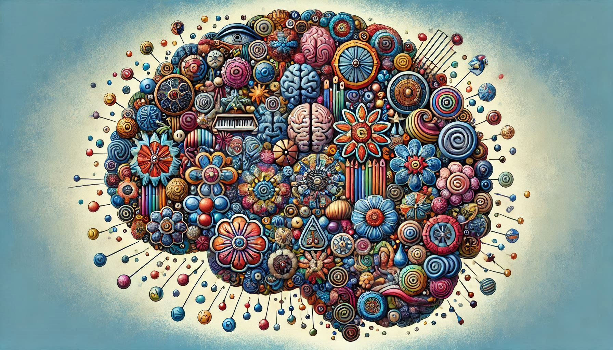

"Second Brain" is a term used to describe a special type of Personal Knowledge Management (PKM), which is a system together with a process for how people gather, classify, store, search, retrieve and share knowledge that is important to them.

The term was popularised by [Tiago Forte](https://www.youtube.com/@TiagoForte)

<a class="rich-link-card" href="https://www.buildingasecondbrain.com" target="_blank">
	

		

	

	

	

		<h1 class="rich-link-card-title">Building a Second Brain</h1>
		

		The proven method to organize your digital life and unlock your creative potential. Harness the full potential of what you know to lead a more fulfilling life.
		

		

		https://www.buildingasecondbrain.com
		

	

</a>

<a class="rich-link-card" href="https://fortelabs.com" target="_blank">
	

		

	

	

	

		<h1 class="rich-link-card-title">ForteLabs.co</h1>
		

		Be more productive than you ever thought possible
		

		

		https://fortelabs.com
		

	

</a>

