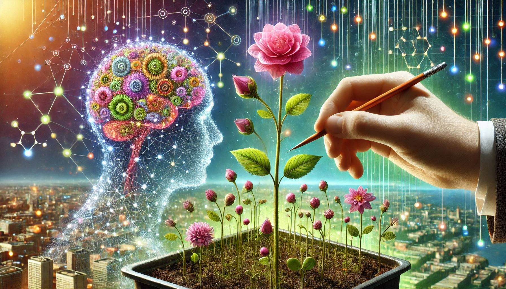

`khandhaja` means "what grows from the stem, a shoot, a sprout" in Pāli (according to [A Dictionary of Pāli](https://gandhari.org/dictionary?section=dop), ed. Margaret Cone, Pali Text Society, ISBN: 978-0-86013-533-3)

![[khandhaja-definition.png]]

This website is a [[Digital Garden]] that contains extracts from my [[Second Brain]], called [`Khandha`](Khandha%20-%20My%20Second%20Brain%20Structure.md) ("a mass, large amount, quantity; body; collection, agglomeration; complex (category); group; aggregate").

- [[Second Brain|What is a Second Brain?]]
- [[Digital Garden| What is a Digital Garden?]]
- [[Khandha - My Second Brain Structure| More information on Khandha, my second brain structure]]