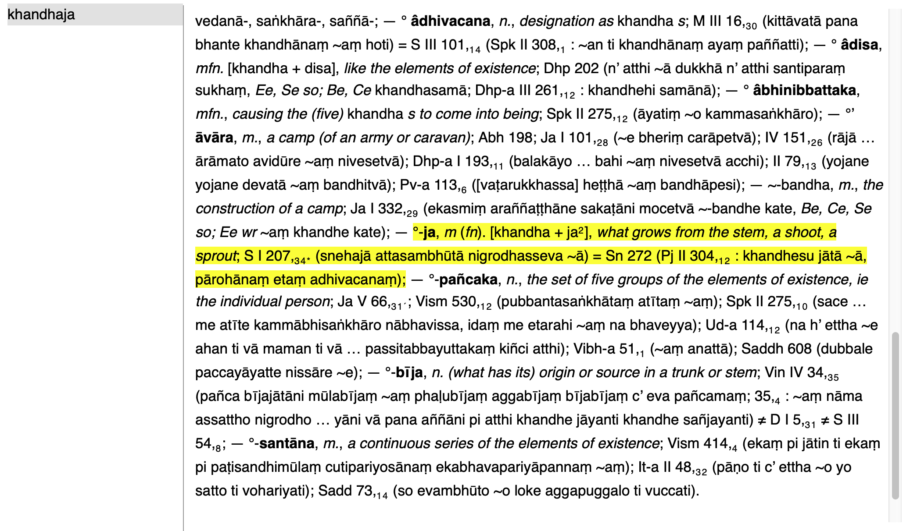

`khandhaja` means "what grows from the stem, a shoot, a sprout" in Pāli (according to [A Dictionary of Pāli](https://gandhari.org/dictionary?section=dop), ed. Margaret Cone, Pali Text Society, ISBN: 978-0-86013-533-3)

This website is a digital garden that contains extracts from my Second Brain, called `Khandha` ("a mass, large amount, quantity; body; collection, agglomeration; complex (category); group; aggregate").
